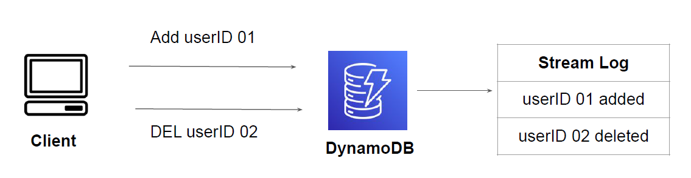
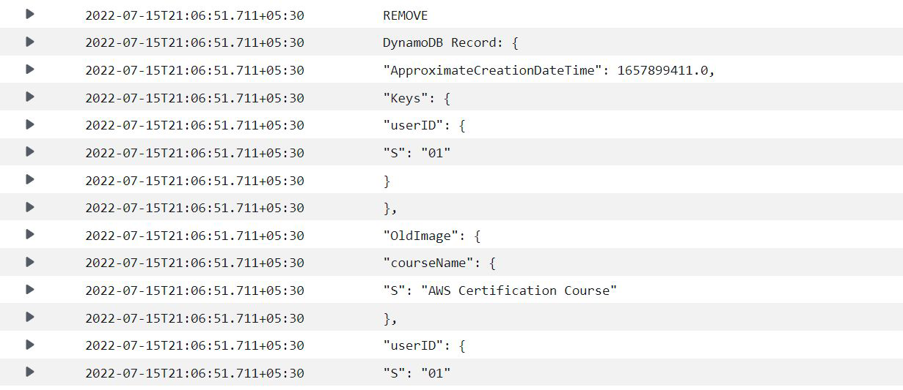
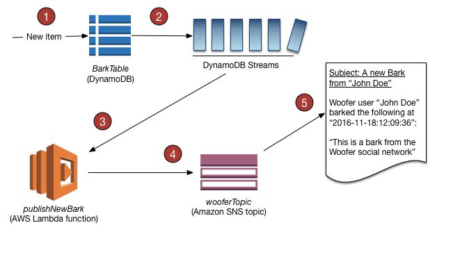

# DynamoDB Streams

"Stream Records Real-Time"

## Understanding the Basics

DynamoDB Streams captures a time-ordered sequence of item-level modifications in any
DynamoDB table and stores this information in a log for up to 24 hours.

Applications can access this log and view the data items as they appeared before and after they
were modified, in near-real time.

## Sample Record Log in CloudWatch

## A Sample Use-Case

## Use-Cases

1. Allows setting up a relationship across multiple tables in which, based on the value of an
item from one table, you update the item in a second table

2. Triggering an event based on a particular item change

3. Audit or Archive Data

4. Replicating Data Across Multiple Tables
