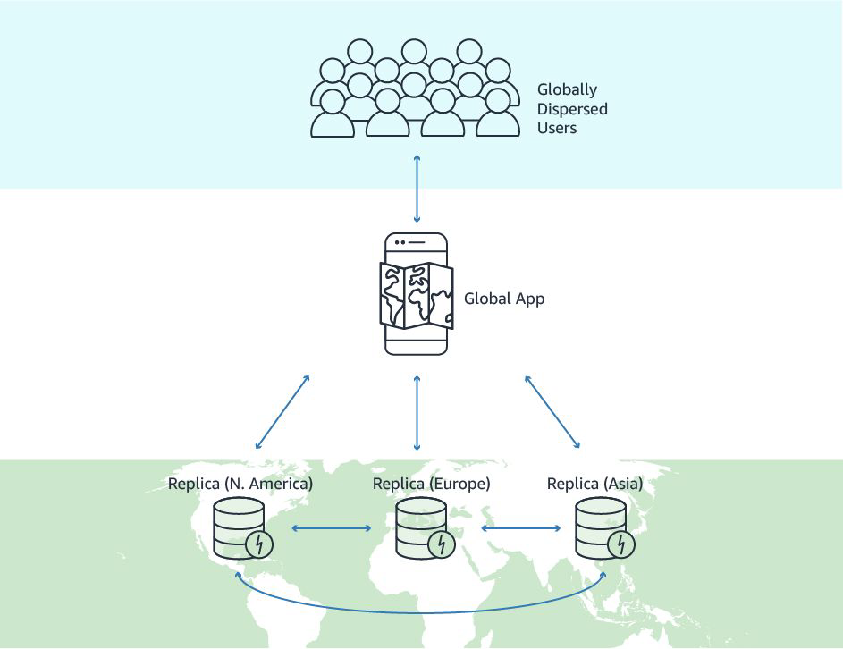

# DynamoDB - Global Table

"Let’s Replicate"

## Basics of Global Tables

Global tables feature provides us with a fully managed, multi-Region, and multi-active
database that delivers fast, local, read and write performance for massively scaled, global
applications.

## Basic Terminology

A global table is a collection of one or more replica tables, all owned by a single AWS
account.

A replica table is a single DynamoDB table that functions as a part of a global table. Each
replica stores the same set of data items.

When an application writes data to a replica table in one Region, DynamoDB propagates
the write to the other replica tables in the other AWS Regions automatically

## Important Pointers

In a global table, a newly-written item is usually propagated to all replica tables within
seconds.

With a global table, each replica table stores the same set of data items. DynamoDB does
not support partial replication of only some of the items.

Conflicts can arise if applications update the same item in different regions at about the
same time. To ensure eventual consistency, DynamoDB global tables use a “last writer
wins”
