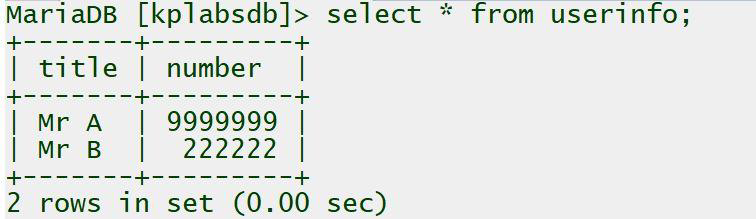
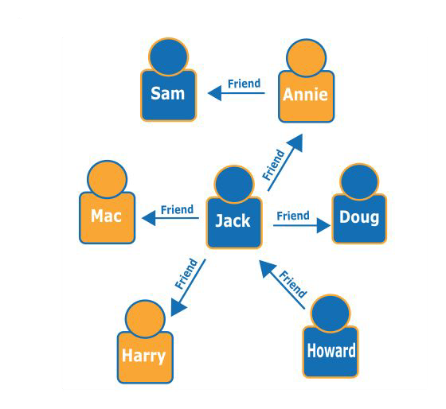
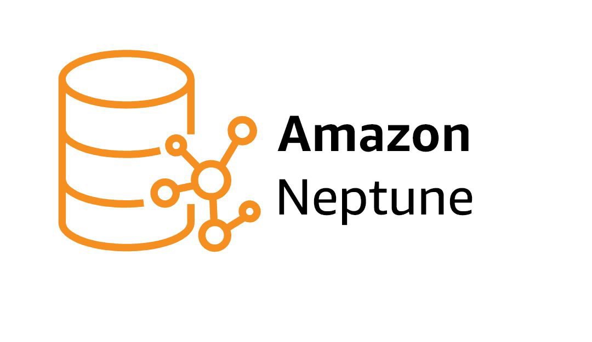
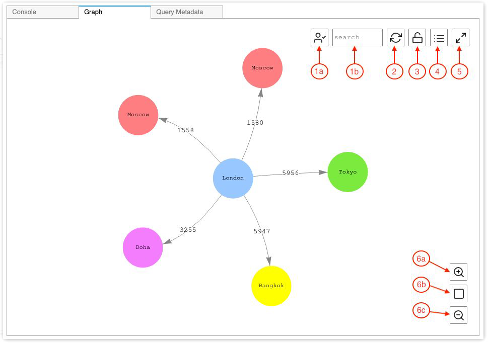

# Amazon Neptune

"Monitor Everything"

## Different Types of Database Technologies

There are multiple different types of database technologies available and each has its own set of
benefits.

Some of the popular ones include:

1. Relational Database [MySQL]

2. NoSQL Databases [key/value] [DynamoDB]

3. Graph Databases [Neptune]

## Revising Relational Databases

Data is organized into tables of columns and rows representing a specific entity type.

Generally uses SQL (Structured Query Language) to manage databases.

Example: MySQL

## Graph Database

A graph database stores nodes and relationships instead of tables.

Whenever connections or relationships between entities are at the core of the data that you're
trying to model, a graph database is your natural choice.

You can easily find out who the "friends of friends" of a particular person are—for example, the
friends of Howard's friends.

## Amazon Neptune

Amazon Neptune is a fast, reliable, fully managed graph database service that makes it easy to
build and run applications that work with highly connected datasets.

## Graph Visualization

In many cases the Neptune workbench can create a visual diagram of your query results.

