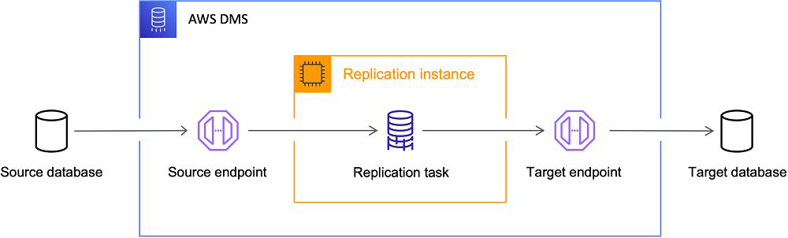
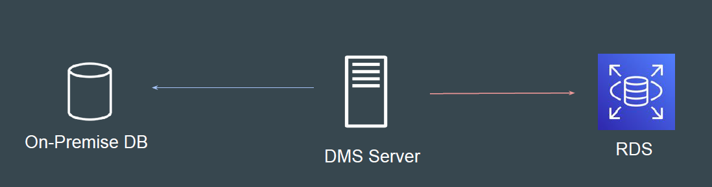

# Database Migration Service

## Understanding the Basics

AWS Database Migration Service (AWS DMS) is a cloud service that makes it
possible to migrate relational databases, data warehouses, NoSQL databases,
and other types of data stores.

You can use AWS DMS to migrate your data into the AWS Cloud or between
combinations of cloud and on-premises setups.

## High-Level Workflow

At a basic level, AWS DMS is a server in the AWS Cloud that runs replication
software.

You create a source and target connection to tell AWS DMS where to extract
from and load to

